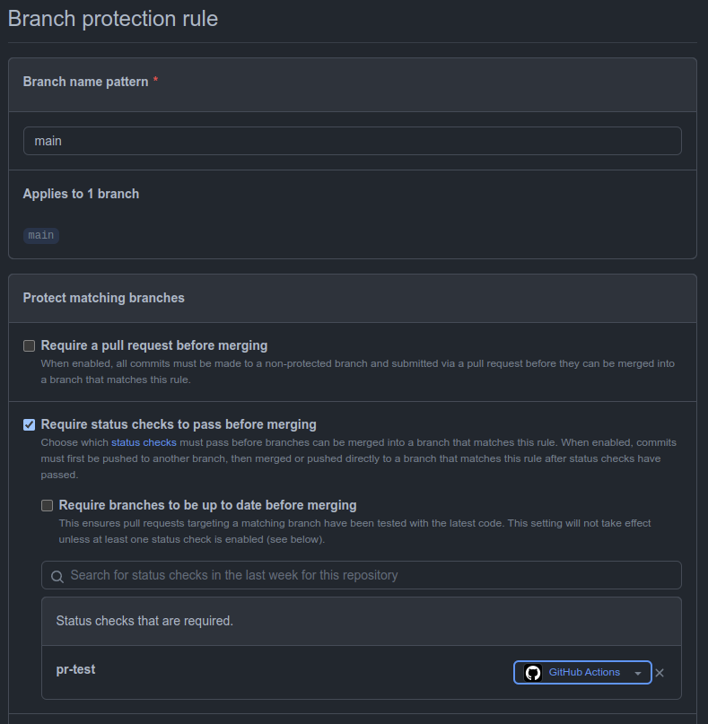

# vv-continuous-integration

- [Continuous Integration](#continuous-integration): workflow yml 파일

- [Secrets](#secrets): workflow yml에 전달할 secrets

- [Branch Protect Rule](#branch-protect-rule): ci 결과로 보호할 branch

- [test-codes](#test-codes): ci시 실행할 test codes를 추가하는 방법


## continuous-integration
- 각 레포의 .github/workflows/${CI-yml-file}을 생성한다.
```yaml
name: continuous-integration
on:
  pull_request:
    branches:
      - main
      - develop

jobs:
  continuous-integration:
    uses: teamdable/vv-continuous-integration/.github/workflows/continuous-integration.yml@main
    with:
      slack-channel: 테스트 중 이상이 발생했을 때 전송될 슬랙 채널
    secrets:
      extra-index-url: ${{ secrets.EXTRA_INDEX_URL }}
      trusted-host: ${{ secrets.TRUSTED_HOST }}
      slack-token: ${{ secrets.SLACK_TOKEN }}
```

## secrets
- ${Repository_URL}/settings/secrets/actions 에서 관리한다.
- 각 레포에는 Secrets에 아래 변수가 추가되어야 한다.
    - EXTRA_INDEX_URL: vv-extra-index-url
    - TRUSTED_HOST: vv-trusted_host
    - SLACK_TOKEN: vv-slackboy-token

## branch-protect-rule

- ${Repository_URL}/settings/branches에서 관리한다.
- 먼저, Target Branch에 .github/workflows/${CI-yml-file} 가 있어야 한다.

### 예시 사진

- CI-yml-file가 pr-test인 경우




### Branch name pattern
Target Branch 이름을 적는다 (e.g. main, develop)

### Protect matching branches

- Require status checks to pass before merging > Status checks that are required에 ${CI-yml-file}를 추가한다

## test-codes

### Repo에서 생성된 PR이 python script인 경우

- version check -> pylinter -> test code로 진행된다
- test code는 각 repo_root/tests/에 위치시킨다.

### Repo에서 생성된 PR이 JavaScript(or TypeScript) 인 경우

- version check -> eslinter(npm run test) -> test code로 진행된다
- test code는 각 repo_root/tests/에 위치시킨다.